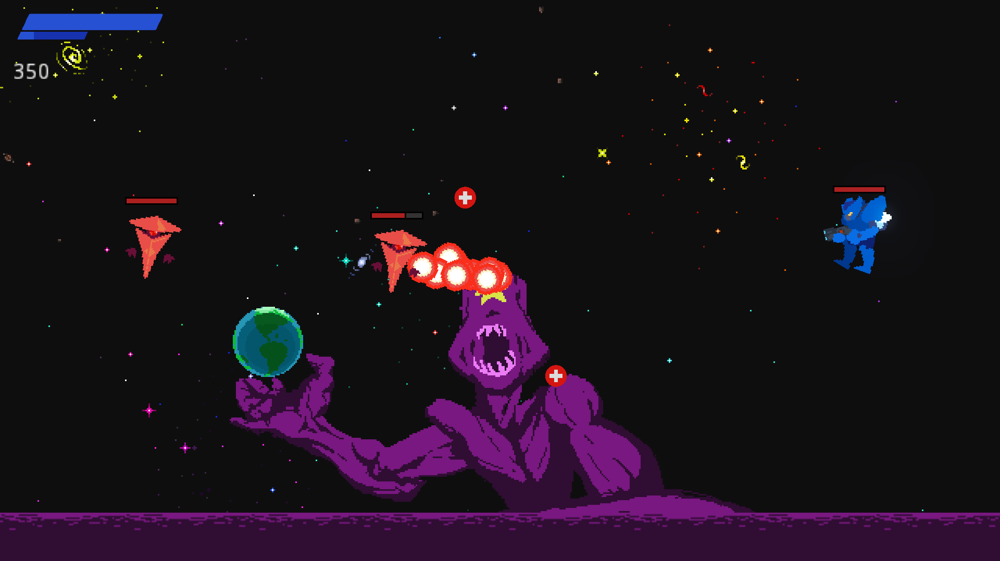

# ElJuego

**És el juego**

Projeto de IDJ da UnB - Semestre 2023.1

## Gameplay

O objetivo do jogo é obter a maior pontuação possível. Para isso, destrua inimigos e ganhe pontos para cada inimigo destruído.

## Controles

- Controle seu mecha com _W_, _A_, _S_, _D_
- Pule com _SPACE_
- Ative o _jetpack_ apertando _SPACE_ no ar
- Mova a mira com o mouse
- Atire com _Mouse 1_ (tiro fraco) e _Mouse 2_ (tiro forte)

## Integrantes

- Alexsander Correa de Oliveira
- David Gonçalves Mendes
- Gustavo Tomás de Paula
- Henrique Souza Moraes
- Mateus de Paula Rodrigues
- Moisés Felipe Jacó Andrade de Lima

:)
